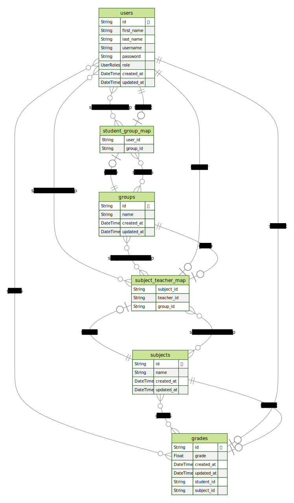

# School LMS

Framework: Nest JS

ORM: Prisma (PostgreSQL)

Swagger URL:

```
http://164.90.238.173/api
```

## Sample users

**Director**

Username

```
director
```

Password

```
password
```

---

**Teacher**

Username

```
teacher
```

Password

```
password
```

---

**Student**

Username

```
studet
```

Password

```
password
```

## Steps to start project locally

1. Copy .env.example content to new .env file

2. Set database URL

3. Run following commands

```
npm ci
```

```
npx prisma migrate deploy
```

```
npx prisma db seed
```

```
npm run start:dev
```

4.

## Diagram


